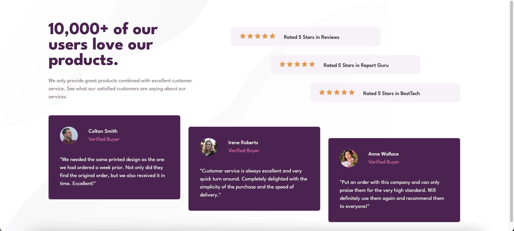
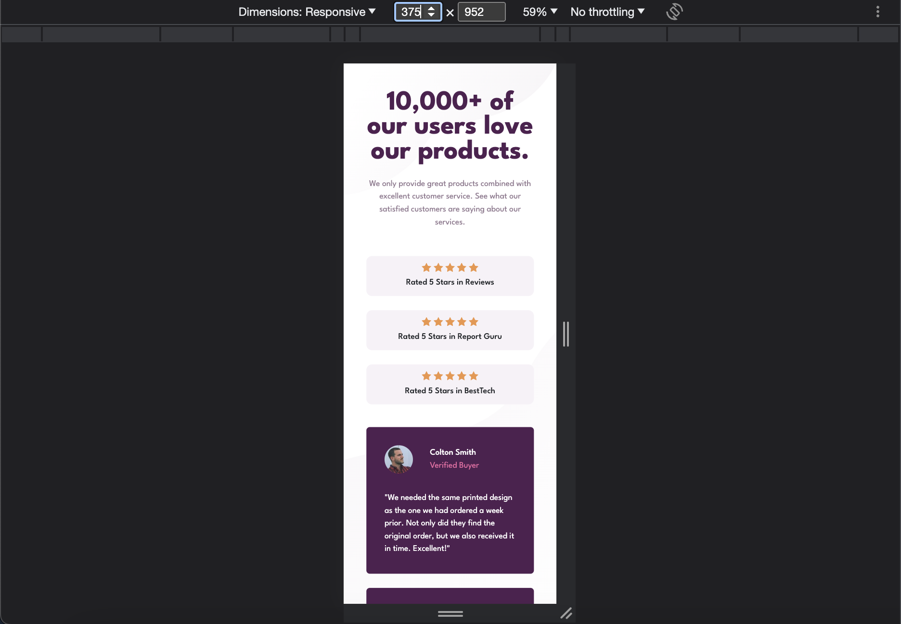

# Frontend Mentor - Social proof section solution

This is a solution to the [Social proof section challenge on Frontend Mentor](https://www.frontendmentor.io/challenges/social-proof-section-6e0qTv_bA). Frontend Mentor challenges help you improve your coding skills by building realistic projects. 

## Table of contents

- [Overview](#overview)
  - [The challenge](#the-challenge)
  - [Screenshot](#screenshot)
  - [Links](#links)
- [My process](#my-process)
  - [Built with](#built-with)
  - [What I learned](#what-i-learned)
  - [Continued development](#continued-development)
- [Author](#author)
- [Acknowledgments](#acknowledgments)

## Overview
### The challenge
Users should be able to:
- View the optimal layout for the section depending on their device's screen size

### Screenshot



### Links
- Solution URL: https://getbootstrap.com/docs/5.3/utilities/flex/#align-self
- Live Site URL: 

## My process
### Built with
- Semantic HTML5 markup
- CSS custom properties
- Bootstrap
- Flexbox
- CSS Grid

### What I learned
讓icon-star用::before及content來實現重複。

```html
<div class="bg-light-grayish-magenta">
  <span class="d-inline-block"></span>
  <p>Rated 5 Stars in Reviews</p>
</div>
```
```css
.rated-section span::before {
    content: url(./images/icon-star.svg) " " url(./images/icon-star.svg) " " url(./images/icon-star.svg) " " url(./images/icon-star.svg) " " url(./images/icon-star.svg);
}
```

### Continued development
grid, flex, position.

## Author
- Frontend Mentor - [@YAcodingroom]
(https://www.frontendmentor.io/profile/YAcodingroom)
- Threads - [@nt19_lya](https://www.threads.net/@nt19_lya)

## Acknowledgments
感謝Ivy&Ciao，感謝Angela老師，感謝靜文老師，感謝Google，感謝Bootstrap，感謝宇宙，感謝自己的韌性。
